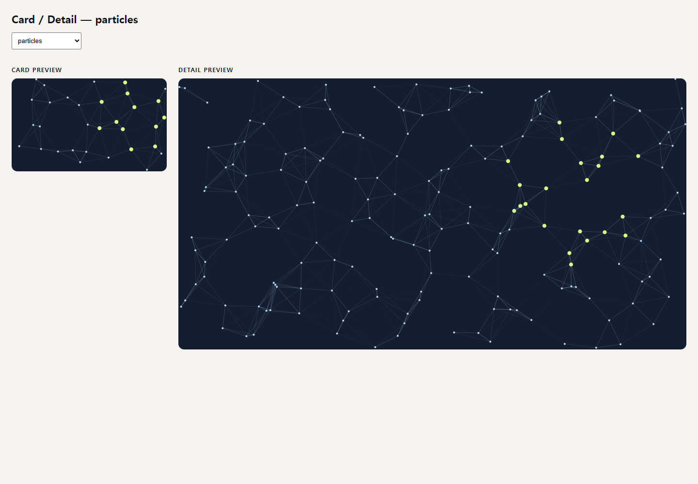
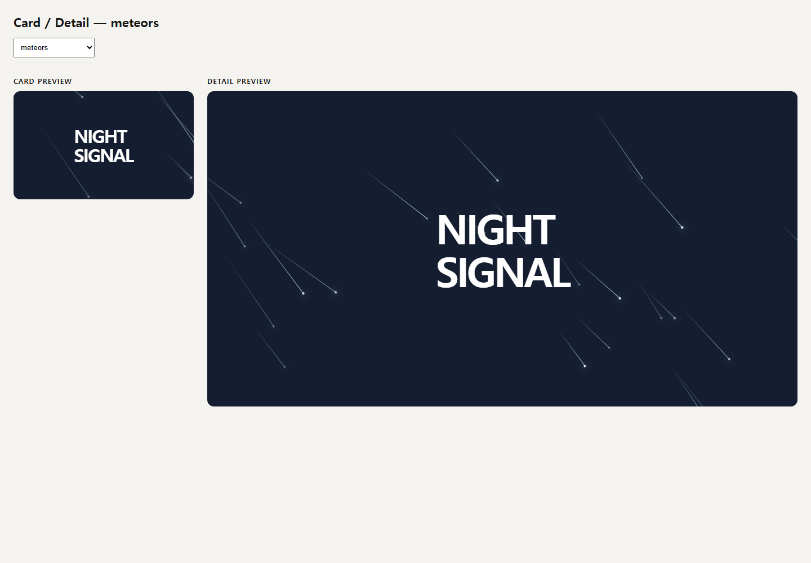
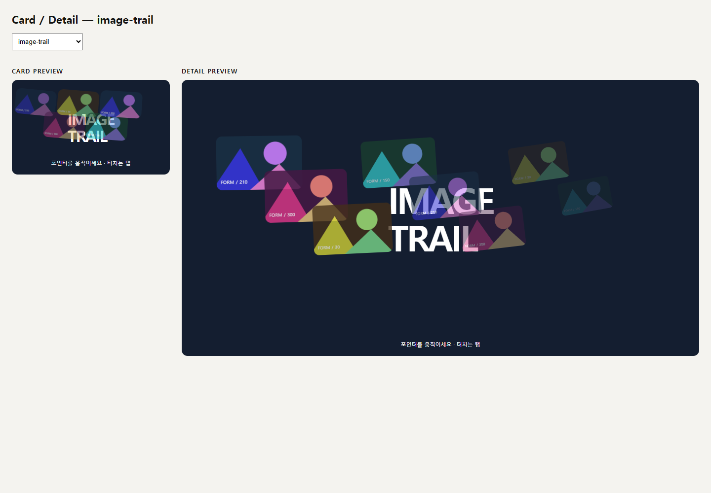
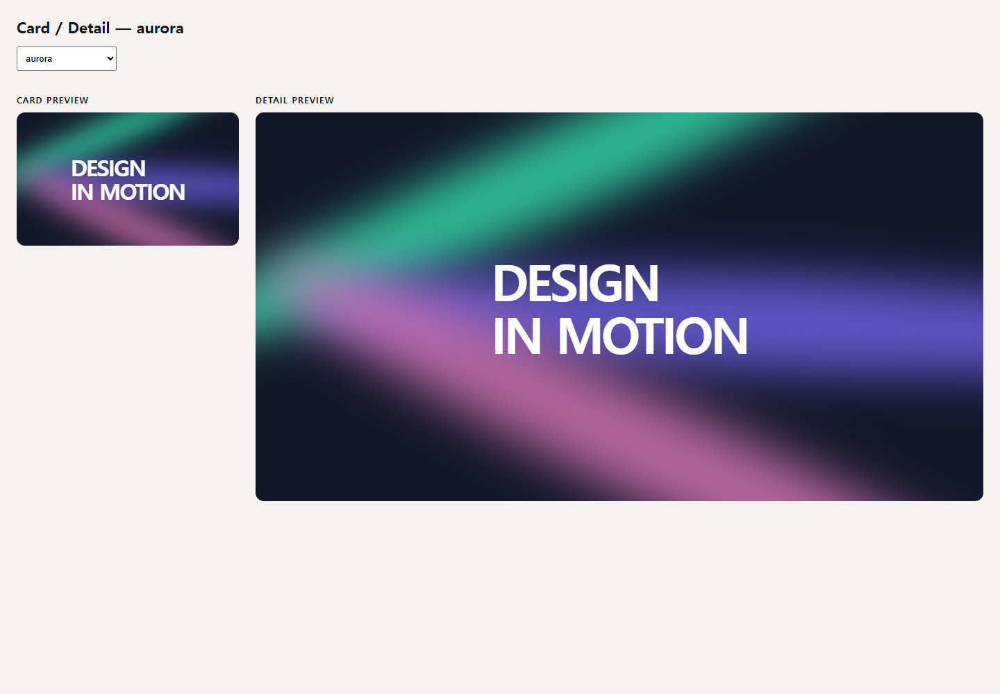
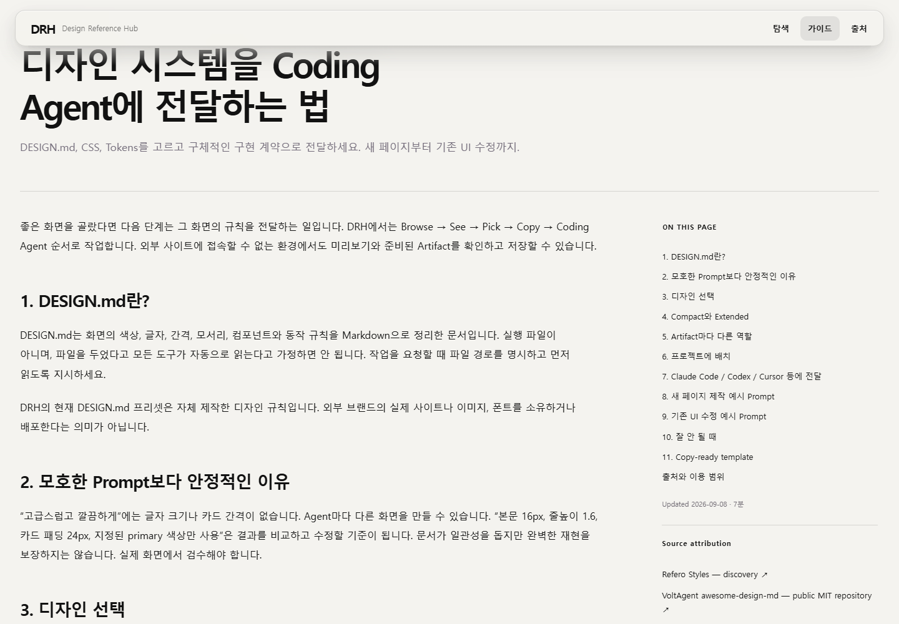
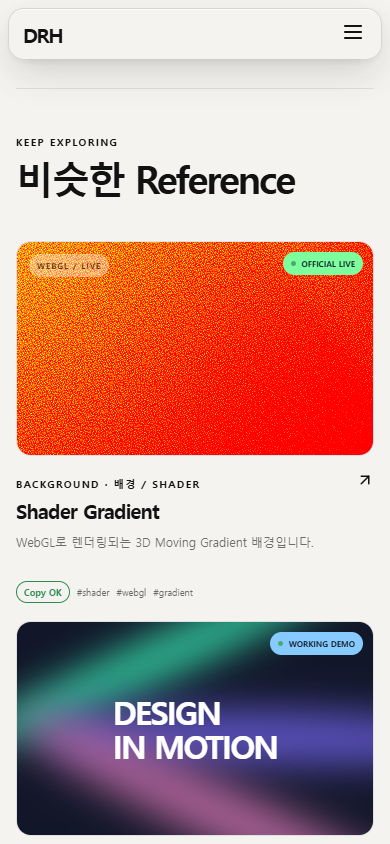

# V1.7 Canonical Demo Fidelity & Layout Audit

검수: 2026-09-09–10. Reference 추가 없음: 기존 167개 유지. ShaderGradient Landing 및 V1.6.2 advanced engines는 변경하지 않았다.

## Demo architecture

코드 수정 전에 167개 key의 dispatch와 export를 조사하여 `V1_7_DEMO_RENDER_PATHS.md`를 작성했다. 해당 문서는 최종 경로 표와 사전 조사 결과를 함께 보존한다.

실행 순서: vendor specimen → advanced React → official ShaderBackdrop preset → recipe iframe → Legacy JSX. Recipe는 `recipeHtml`을 통해 Card, Detail, HTML export가 동일한 구현을 실행한다. `fidelityRecipes.ts`는 이번에 정리한 canonical 구현을 보관하고 `recipes.ts`가 공개 registry를 구성한다. Agent Package의 Implementation Logic/Acceptance Criteria도 그 registry를 읽는다. Advanced 설명을 recipe보다 먼저 선택하도록 고쳐 Fluid Cursor가 구형 spotlight 설명을 내보내던 문제를 제거했다.

사전 조사에서 Parallax/Magnetic/Hover는 이미 최종 recipe가 달랐다. 공통 초기화만 보고 동일 데모라고 판정하지 않았다. 이번에는 공통 초기화 자체를 없애고 Parallax 3개 depth layer, Tilt 단일 perspective 회전, Magnetic 버튼 이동, Hover Lift의 수직 이동/그림자를 명시적으로 분리했다.

Legacy의 Particles, ImageTrail, MagneticButton 함수와 recipe에 가려진 조건 분기들을 제거했다. Aurora/Mesh/Stars/Beams/Waves, scroll/text/image effects, lens/card effects 등의 shadowed JSX도 실제 registry 존재를 확인한 뒤 제거했다. `TiltCard`는 `style-clay`, `Accordion`은 Legacy 호환 경로에 남아 있으므로 삭제하지 않았다. Advanced Fluid/Metaballs의 구형 JSX도 제거했으며 advanced engine 자체는 유지했다.

## Fixed aliases

| Before | Final |
|---|---|
| Spotlight / Cursor Follow의 동일 light 구현 | Spotlight는 면적에 맞게 커지는 radial illumination, Cursor Follow는 윤곽선 ring 추종 |
| Fluid Cursor의 unused spotlight recipe | 제거; advanced React/standalone engine/advanced package 설명 |
| Gradient Mesh / Noise Blobs의 거의 동일한 색상장 | Noise Blobs는 비대칭 유기적 형상, warm palette, 낮은 blur와 뚜렷한 fractal grain |
| Accordion Motion / FAQ의 동일 object | Motion은 하나의 animated disclosure, FAQ는 제목과 독립적인 3개 질문으로 구성한 support section |
| Parallax / Tilt / Magnetic / Hover의 공통 초기화 | key마다 canonical 구현과 고유한 입력 계약 |

허용 alias는 `audit:demos`에서만 allowlist로 관리한다:

- `glass-card` / `style-glass`: 같은 frosted material을 Styles와 Effects에서 의도적으로 보여준다. 재료와 그 적용 컴포넌트의 관계다.
- `liquid-lens` / `liquid-lens-effect` / `style-liquid`: 같은 굴절 재료의 호환 key. 현재 Reference에서 사용하지 않는 key도 명시적으로 식별한다. RGB Lens는 별도 색 분리 강도로 구분한다.
- `spotlight` / `spotlight-background`: Pointer Spotlight의 호환 명칭. 현재 별도의 두 Reference가 같은 시각물을 중복 노출하지 않는다.

## Density policy

`densityPolicy(kind)`는 density-sensitive / scale-sensitive / fixed-object를 반환한다. HTML의 `data-density`, `data-variant`에 기록되며 audit가 모든 recipe의 정책과 두 variant의 실행 가능성을 검사한다. Card는 작은 실제 컨테이너에서 가볍게 실행하고 Detail은 컨테이너에 따라 개수/반경/크기를 늘린다. 숫자 두 개를 variant에 따라 대입하는 방식은 제거했다.

| Demo | Policy | Implementation / acceptance |
|---|---|---|
| Interactive Particles | density-sensitive | normalized coordinates; `clamp(round(area/3000),32,180)`; spatial buckets; spacing에 따른 65–125px connection, 85–180px pointer radius |
| Meteors | density-sensitive | `clamp(round(area/14000),7,35)`; seed 1707; 35–58° angle, 70–180px tail, 2.4–5.2s duration, negative random delay, opacity/head variation; container-relative travel |
| Dot Grid | density-sensitive | 30 CSS px 간격; Canvas rows/columns; pointer radius = 4 cells; resize/input에서만 draw, 점별 DOM 없음 |
| Retro Grid | density-sensitive | 40px CSS background grid; 44% horizon과 perspective; sun은 짧은 viewport 변에 맞춰 확대 |
| Starfield | density-sensitive | normalized positions; `clamp(round(area/2000),45,400)`; depth/twinkle/drift |
| Beams | density-sensitive | container width/100 기준 4–14개의 shaft, 독립 animation phase |
| Waves | density-sensitive | Canvas 28px row spacing, 높이에 비례하는 amplitude ≤40px |
| Aurora | scale-sensitive | 3개 ribbon의 percentage geometry, container-scaled blur 18–40px |
| Gradient Mesh | scale-sensitive | percentage ellipses, blur 24–65px |
| Noise Blobs | scale-sensitive | percentage organic geometry, blur 6–18px, grain .3 opacity |
| Spotlight | scale-sensitive | radial light 200–600px, container width에 비례 |
| Image Trail | density-sensitive | actual embedded SVG images; area/22000 기준 8–24개 cap, width 90–180px, 850ms lifetime; mouse trail/touch tap |
| Confetti | density-sensitive | area/7000 기준 16–64개; travel = 짧은 변의 38%; 새 burst는 이전 burst 교체 |
| Ripple | scale-sensitive | 단일 ring의 최종 반경을 container diagonal로 계산; 850ms cleanup |
| Cursor Follow | scale-sensitive | 40–85px outlined follower, 130ms easing |
| Image Reveal / Comparison | scale-sensitive | full-surface images; clip mask / native range; 이미지 자체 크기를 왜곡하지 않음 |
| Animated Border / Shimmer | fixed-object | padding/font를 container 폭에 따라 확대; 회전하는 border와 surface sweep 구분 |
| Parallax / Tilt / Magnetic / Hover Lift | fixed-object | depth layers / perspective card / translating button / elevated card의 고유 입력 동작 |

Canvas DPR ≤1.5, count cap, ResizeObserver cleanup, pagehide RAF cleanup을 유지한다. 숨긴 문서는 RAF를 중단하고 DemoViewport는 화면 밖의 iframe/advanced surface를 unmount한다. iframe 경계를 나갈 때 누락되는 pointerleave는 parent 문서의 pointer 입력을 안전한 reset message로 전달하여 해결했다. Child는 parent source와 정확한 message type만 허용하고 main/canvas의 기존 leave handler를 실행한다. Export에서도 기존 native leave handler가 동작한다.

## Fidelity status

- WORKING DEMO 134, OFFICIAL LIVE 1, PROTOTYPE 32.
- Working 유지: 기존 canonical recipes 및 Fluid Cursor / Metaballs / Liquid Refraction.
- Working → Prototype: 없음.
- Prototype → Working: Starfield, Beams, Waves. 실제 responsive 구현과 동일한 standalone export/설명/acceptance를 추가하고 브라우저 비교를 수행했다.
- 새 Reference 없음. 나머지 Prototype을 완성됐다고 일괄 승격하지 않았다.

## Guide layout

Guide list/article은 32px wide shell, mobile 20px gutter를 사용한다. Intro에 page gutter를 다시 적용하던 공통 selector와 1440px page 제한을 제거했다. Article은 desktop 940px reading column과 sticky rail, tablet 920px 이하 reading column과 stacked rail이다. Rail은 TOC, 날짜/읽기 시간, Source, DESIGN.md CTA, 관련 Guide를 제공한다.

TOC는 ReactMarkdown과 동일한 Markdown parser AST의 h2/h3로 생성한다. 한국어 Unicode slug, inline labels, duplicate 및 `-2` suffix 충돌, setext heading, fenced-code exclusion을 검사한다. 링크를 키보드로 실행하면 해당 heading에 focus를 옮기고 110px sticky-header offset으로 스크롤한다. 본문의 중복 h1은 숨겨 페이지 hero 하나만 유지한다. 이미 설치돼 있던 unified/remark-parse를 직접 의존성으로 명시했다.

일반 prose의 `overflow-wrap:anywhere !important`를 제거했다. `keep-all`, `normal`, `line-break:strict`, `text-wrap:pretty`를 사용하고 code/URL만 별도로 wrap한다. 5개 너비에서 두 Guide의 hero/본문 wrapping을 확인했고 가로 overflow는 없었다. 폰트와 이후 콘텐츠 변경까지 모든 orphan을 영구 보장하는 규칙은 아니다.

## Related cards and CSS cleanup

공통 `--reference-preview-ratio:5 / 3`와 `height:auto`를 사용한다. Related 190px, Explore 230px, collection 200px 및 mobile 일반 카드 260px 고정 높이를 제거했다. Large/featured 높이 예외는 유지한다. 실제 Explore/Related의 5개 viewport 측정값은 모두 1.6667 근처다.

Guide intro를 공통 hero override에서 분리하고 `.guides-listing`의 사용되지 않는 규칙, article의 late max-width/`!important` override를 제거했다. `.artifact-panel`, `.artifact-panel pre`, `.artifact-file`, `.artifact-mode`와 button의 최종 dark-viewer/segmented-control 선언을 원래 컴포넌트 규칙으로 합쳤다. Desktop workspace sizing은 base 근처로 이동하고 1200px breakpoint와 일치시켰다. 전역 header/footer/toolbar 재설계는 수행하지 않았다.

## Visual QA

개발 전용 `/tests/demo-scale/` fixture는 실제 DemoRenderer의 card/detail을 나란히 표시한다. Production navigation에는 추가하지 않았다.

- Edge Chromium headless, 1920×1080 / 1440×1000 / 1366×768 / 1024×768 / 390×844.
- 26개 demo × 5 viewport × card/detail의 실제 렌더링과 pointer 입력 순회; pageerror 0. 필수 16개와 density-sensitive 추가 목록을 포함한다.
- Particles / Meteors / Dot Grid / Image Trail / Aurora는 5개 너비 screenshot 비교. 다른 필수 효과도 1440px 비교 이미지 및 contact sheets로 검수했다.
- 최종 Noise Blobs, Retro Grid, Magnetic, Border, Shimmer, FAQ 변경은 별도 5-viewport 재검증으로 기록한다.
- Guide list, 두 article, 실제 `/reference/particles` Related 검증. 첫 exploratory 스크립트의 잘못된 reference URL은 수정하여 재검증했으며 최종 증거는 실제 페이지다.
- 32개 interaction/export/reduced-motion 검사: four canonical interactions 및 원점 복귀, keyboard hover/focus, confetti/ripple cleanup, meteor variation, resize count/DPR cap, offline exports, keyboard TOC.
- Particles standalone 1024×600 / 180개 / 120 frames: median 16.7ms, p95 16.8ms, max 17.2ms. Headless host의 frame interval 측정이며 모든 GPU의 성능 보장은 아니다.

증거 JSON: `artifacts/v1.7/results.json`, `final-adjustments.json`, `interactions.json`, `final-evidence.json`. 재현 script: `tests/demo-scale/browser-qa.mjs`, `interactions.mjs`, `final-evidence.mjs`. 시스템 Playwright가 없다면 `PLAYWRIGHT_PATH`에 설치된 package 경로를 지정한다. 먼저 `npm run dev -- --host 127.0.0.1`을 실행한다.

### 대표 Card / Detail 비교

### Guide / Related

## Regression

`npm run typecheck`, `npm run build`, `npm run audit:v1.4`, `npm run audit:design-md`, `npm run audit:demos`, `npx tsc --noEmit -p tests/advanced-demos/tsconfig.json`, `node tests/advanced-demos/audit.mjs`, `git diff --check` 모두 통과했다. Build의 기존 대형 bundle advisory는 남는다. V1.4 audit가 생성하는 상태 문서 두 개는 시작 시 존재한 로컬 변경을 보존하기 위해 실행 후 원래 bytes로 복원했다.

## Remaining fidelity priorities

1. Claymorphism: 아직 기존 TiltCard의 구도를 사용하는 Prototype이다. clay 재료의 부드러운 다층 그림자와 원근 회전을 분리하는 별도 데모가 필요하다.
2. Shape Morph: Legacy CSS shape 예시는 있으나 독립 export/동작 계약이 완성되지 않은 Prototype이다.
3. Contact Split, Login/Signup, Dashboard/Admin 등 기존 page/section Prototype: 정적인 폼·데이터 모양을 보여주는 단계이며 실제 상태/검증/완전한 export는 없다. 이번 Background/Motion fidelity 통과를 근거로 이들을 Working으로 표시하지 않았다.

## Git scope

Commit message: `feat: normalize demo fidelity across card and detail views`.
사용자가 이미 변경한 `advancedRecipes.js` 삭제, V1.4 상태 문서 두 개와 작업 중 나타난 별도 research/source-map 디렉터리는 이 commit에서 제외한다.
